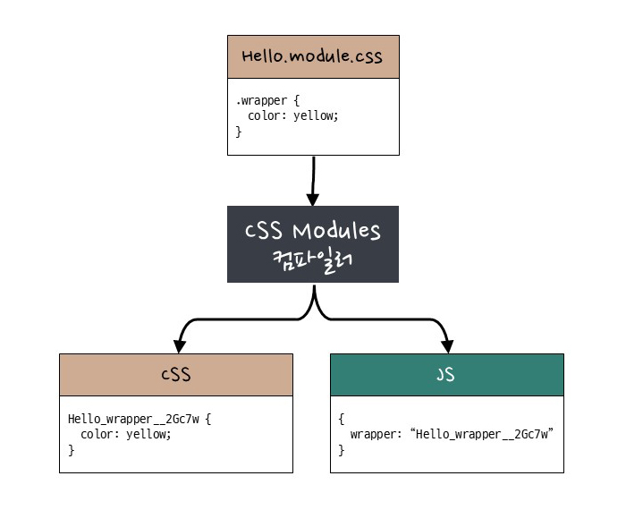

# CSS Module

### CSS Module

- CSS Module
    - 정의
        - CSS 사용 시 Class 이름을 고유한 값으로 자동 생성하는 것을 의미함.
        - 빌드 단계에서 이루어지는 프로세스에 가까움.
            - Webpack이나 Vite 등에서 지원함.
        - 클래스 이름과 선택자를 스코프화함(일종의 네임스페이스처럼)
    
    
    
- CSS Module 사용 배경
    - 외부 CSS 파일을 참조하는 방식은 애플리케이션 규모가 커질 수록 CSS 클래스명이 중복될 가능성이 높아짐.
        - 서로 다른 두 개의 CSS 파일에 동일한 이름의 CSS 클래스가 정의되어 있다면, 해당 클래스가 적용된 React 엘리먼트는 두 스타일이 모두 한꺼번에 적용됨.
    - 문제 해결법
        - CSS Module은 CSS 클래스를 불러와 사용할 때 클래스명을 고유한 이름으로 자동 변환함.
        - `{모듈명}.module.css` 로 스타일 파일이름 생성하면 적용됨.(일반적)
            
            ```css
            ├── components
            │   ├── Header.js
            │   └── Header.module.css
            ```
            
        
- CSS Module 예시
    - 일반적인 CSS
        
        ```css
        /* Button.module.css */
        .button {
          background-color: blue;
          color: white;
        }
        ```
        
        - 이렇게 선언할 경우 동일한 button 클래스가 여러 곳에서 사용되면 `button` 스타일이 충돌날 수 있음.
    - CSS Module의 역할
        - 동일한 `button` 으로 선언한 예시
            
            ```css
            /* PrimaryButton.module.css */
            .button {
              background-color: blue;
              color: white;
              padding: 10px 20px;
              border: none;
              border-radius: 5px;
              cursor: pointer;
            }
            ```
            
            ```css
            /* SecondaryButton.module.css */
            .button {
              background-color: gray;
              color: black;
              padding: 8px 18px;
              border: 1px solid black;
              border-radius: 3px;
              cursor: pointer;
            }
            ```
            
        - 각각 React 컴포넌트에서 사용했다고 가정
            
            ```jsx
            // PrimaryButton.js
            import styles from './PrimaryButton.module.css';
            
            function PrimaryButton() {
              return <button className={styles.button}>Primary Button</button>;
            }
            
            export default PrimaryButton;
            ```
            
            ```jsx
            // SecondaryButton.js
            import styles from './SecondaryButton.module.css';
            
            function SecondaryButton() {
              return <button className={styles.button}>Secondary Button</button>;
            }
            
            export default SecondaryButton;
            
            ```
            
            ```jsx
            // App.js
            import PrimaryButton from './PrimaryButton';
            import SecondaryButton from './SecondaryButton';
            
            function App() {
              return (
                <div>
                  <PrimaryButton />
                  <SecondaryButton />
                </div>
              );
            }
            
            export default App;
            ```
            
        - 개발자 도구(F12)에서 확인할 수 있는 결과
            
            ```html
            <div>
              <button class="button_xyz123">Primary Button</button>
              <button class="button_abc456">Secondary Button</button>
            </div>
            ```
            
            - `button` 에 고유 값이 될 수 있도록 식별자가 붙음.
            
- CSS Module의 사용 효과
    - `Local Scope Prevents Clashes`
        - 프로젝트의 다른 부분에서 발생할 수 있는 스타일 충돌을 방지함.
        - 컴포넌트 단위의 스타일링이 가능해짐.
    - `Clear Style Dependencies`
        - 컴포넌트와 스타일의 영향 범위가 명확해져 코드 가독성과 유지 보수성이 향상됨.
    - `Solves Global Scope Problems`
        - 전역에 스타일이 적용되어 프로젝트에 영향 미치는 문제 방지.
    - `Boosts Reusability and Modularity`
        - 재사용성과 모듈화 향상.
            - 서로 다른 모듈에서 같은 클래스 이름 사용이 가능해짐.

- 설치 / 호환
    - 모듈 번들러를 통해서 사용한다.
        - Webpack
        - Rollup
        - Parcel
        - Vite
    - React CRA(`creat react app`)를 사용할 경우 Webpack을 내장하여 빌드 및 개발 환경을 제공함. 따라서 CSS Modules가 기본으로 지원됨.

- 함께 사용하는 CSS
    - Sass/SCSS
        - CSS Modules와 가장 많이 사용되는 CSS 전처리기

### CSS Module과 유사한 형태를 택하는 CSS 라이브러리들

- styled-component
    
    ```jsx
    // StyledButton.js
    import styled from 'styled-components';
    import Button from './Button'; // Button 리액트컴포넌트로 정의되어 있다고 가정
    
    const StyledButton = styled(Button)`
      background-color: blue;
      color: white;
      padding: 10px 20px;
      border: none;
      border-radius: 5px;
      cursor: pointer;
    
      &:hover {
        background-color: darkblue;
      }
    `;
    
    export default StyledButton;
    ```
    
    ```jsx
    // App.js
    import React from 'react';
    import StyledButton from './StyledButton';
    
    function App() {
      const handleClick = () => {
        alert('버튼이 클릭되었습니다.');
      };
    
      return (
        <div>
          <StyledButton onClick={handleClick}>
            클릭하세요
          </StyledButton>
        </div>
      );
    }
    
    export default App;
    
    ```
    
    - HTML / CSS
        
        ```html
        <div>
          <button class="sc-bdfBwQ cIKpxA">클릭하세요</button>
        </div>
        ```
        
        ```css
        .cIKpxA {
          background-color: blue;
          color: white;
          padding: 10px 20px;
          border: none;
          border-radius: 5px;
          cursor: pointer;
        }
        .cIKpxA:hover {
          background-color: darkblue;
        }
        ```
        
    - 임의의 클래스명이 생성되며 CSS도 동일하게 임의의 이름으로 할당된다.
- JSS(Javascript Style Sheets)
    
    ```jsx
    // Button.js
    import React from 'react';
    import { createUseStyles } from 'react-jss';
    
    // JSS 스타일 정의
    const useStyles = createUseStyles({
      button: {
        backgroundColor: 'blue',
        color: 'white',
        padding: '10px 20px',
        border: 'none',
        borderRadius: '5px',
        cursor: 'pointer',
        '&:hover': {
          backgroundColor: 'darkblue',
        },
      },
    });
    
    function Button({ children, onClick }) {
      // 스타일 클래스 생성
      const classes = useStyles();
    
      return (
        <button className={classes.button} onClick={onClick}>
          {children}
        </button>
      );
    }
    
    export default Button;
    
    ```
    
    ```jsx
    // App.js
    import React from 'react';
    import Button from './Button';
    
    function App() {
      const handleClick = () => {
        alert('버튼이 클릭되었습니다.');
      };
    
      return (
        <div>
          <Button onClick={handleClick}>클릭하세요</Button>
        </div>
      );
    }
    
    export default App;
    ```
    
    - HTML /  CSS
        
        ```html
        <div>
          <button class="button-0-1-1">클릭하세요</button>
        </div>
        ```
        
        ```css
        .button-0-1-1 {
          background-color: blue;
          color: white;
          padding: 10px 20px;
          border: none;
          border-radius: 5px;
          cursor: pointer;
        }
        .button-0-1-1:hover {
          background-color: darkblue;
        }
        ```
        
    - 임의의 클래스명이 생성되며 CSS도 동일하게 임의의 이름으로 할당된다.

---

### 참고자료

[https://velog.io/@hamsoo159/CSS-Css-module이란-Css-module-사용-이유](https://velog.io/@hamsoo159/CSS-Css-module%EC%9D%B4%EB%9E%80-Css-module-%EC%82%AC%EC%9A%A9-%EC%9D%B4%EC%9C%A0)

[https://www.tcpschool.com/react/react_styling_cssmodule](https://www.tcpschool.com/react/react_styling_cssmodule)

[https://css-tricks.com/css-modules-part-1-need/](https://css-tricks.com/css-modules-part-1-need/)

[https://github.com/css-modules/css-modules](https://github.com/css-modules/css-modules)

[https://enjoydev.life/blog/frontend/4-module-bundler](https://enjoydev.life/blog/frontend/4-module-bundler)

[https://velog.io/@sangpok/Vite-CSS-Module-module.scss-설정](https://velog.io/@sangpok/Vite-CSS-Module-module.scss-%EC%84%A4%EC%A0%95)