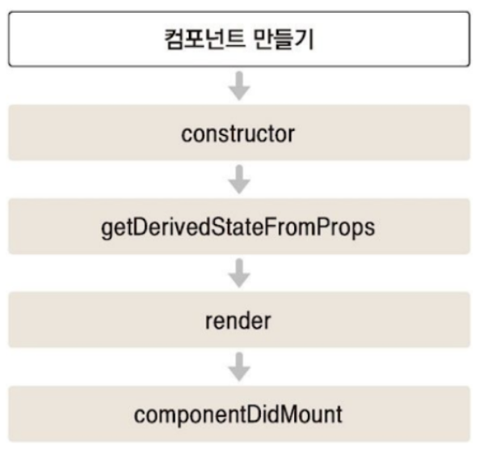
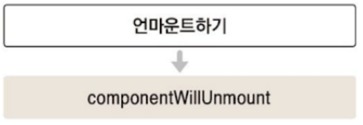

## React의 라이프사이클 메서드

### 라이프사이클이란?

모든 리액트 컴포넌트에는 라이프사이클(생명주기)이 존재한다. 컴포넌트의 수명은 페이지에 렌더링 되기 전인 준비과정에서 시작하여 페이지에서 사라질 때 끝난다.


> **컴포넌트의 라이프사이클**
>
> - 마운트(mount): DOM이 생성되고 웹 브라우저 상에 나타나는 것
> - 업데이트(update): props가 바뀌거나, state가 바뀌거나, 부모 컴포넌트가 리렌더링되거나, this.forceUpdate에 의해 강제로 렌더링을 트리거할 때 일어남
> - 언마운트(unmount): 마운트의 반대 과정으로, DOM에서 컴포넌트를 제거하는 것

이 생명주기를 관리해주는 것이 바로 라이프사이클 메서드이다. 이는 리액트 프로젝트를 진행할 때에 컴포넌트를 처음으로 렌더링할 때 어떤 작업을 처리한다거나, 컴포넌트 업데이트 전후로 어떤 작업을 처리하거나, 불필요한 업데이트를 방지해야 할 때 사용한다.

참고로 라이프사이클 메서드는 클래스형 컴포넌트에서만 사용할 수 있다. 함수형 컴포넌트에서 생명주기를 관리하고자 한다면 Hooks 기능을 사용하여 비슷한 작업을 처리할 수 있다.

<br>

### 라이프 사이클 메서드의 이해

라이프사이클 메서드의 종류는 총 9가지이다. 컴포넌트의 라이프사이클인 마운트, 업데이트, 언마운트 세가지 상태를 통해 라이프사이클 메서드를 이해해보자.

#### 마운트(mount)

위에서 말했듯이 마운트는 DOM이 생성되고 웹 브라우저에 컴포넌트가 나타나는 것을 말한다. 이때 호출하는 메서드를 살펴 보자.



- constructor: 컴포넌트를 새로 만들 때마다 호출되는 클래스 생성자 메서드
- getDerivedStateFromProps: props에 있는 값을 state에 넣을 때 사용하는 메서드
- render: UI를 렌더링하는 메서드
- componentDidMount: 컴포넌트가 웹 브라우저상에 나타난 후 호출하는 메서드

<br>

#### 업데이트

컴포넌트가 업데이트되는 상황에는 어떤 것들이 있을까?

1. 부모 컴포넌트에서 넘겨주는 props가 바뀔 때
2. 컴포넌트 자신이 들고 있는 state가 setState를 통해 업데이트될 때
3. 부모 컴포넌트가 리렌더링 될 때

위와 같이 컴포넌트가 업데이트될 때에 호출하는 메서드를 알아보자.


- getDerivedStateFromProps: 마운트 과정에서도 호출되는 메서드로, 업데이트를 시작하기 전에도 호출이 된다. props의 변화에 따라 state 에도 변화를 주고 싶을 때 사용한다.
- shouldComponentUpdate: 컴포넌트가 리렌더링을 해야 할지 말아야 할지 결정하는 메서드로, true/false 값을 반환한다.
  - true를 반환하면 라이프사이클 메서드를 계속 실행하고, false를 반환하면 작업을 중단한다.
  - 만약 특정 함수에서 this.forceUpdate() 함수를 호출한다면 이 과정을 생략하고 바로 render 함수를 호출한다.
- render: render 메서드를 호출함으로써 컴포넌트를 리렌더링한다.
- getSnapshotBeforeUpdate: 컴포넌트 변화를 DOM에 반영하기 바로 직전에 호출하는 메서드이다.
- componentDidUpdate: 컴포넌트의 업데이트 작업이 끝난 후 호출하는 메서드이다.

<br>

#### 언마운트

컴포넌트가 DOM에서 사라질 때는 어떤 메소드를 호출하는지 알아보자.



- componentWillUnmount: 컴포넌트가 웹 브라우저상에서 사라지기 전에 호출하는 메서드이다.

<br>
<br>

### 라이프사이클 메서드 자세히 살펴보기

#### render()

```js
render(){ ... }
```

이 메서드는 컴포넌트의 모양새를 정의한다. 따라서 컴포넌트에서 가장 중요한 메서드라고 할 수 있는데, 이는 라이프사이클 메서드 중 유일한 필수 메서드이다.

<br>

**특징**

- 이 메서드 안에서 `this.props`, `this.state` 접근 가능
- 리액트 요소 반환
- 이벤트 설정이 아닌 곳에서 setState 사용 불가능
- 브라우저 DOM에 접근 불가
  - DOM 정보를 가져오고 싶을 때는 componentDidMount에서 처리해야 함

#### constructor

```js
constructor(props){ ... }
```

이 메서드는 컴포넌트의 생성자 메서드로 컴포넌트를 만들 때 처음으로 실행된다. 이 메서드에서 초기 state를 설정할 수 있다.

#### getDerivedStateFromProps

```js
static getDerivedStateFromProps(nextProps, prevState){
    if(nextProps.value !== prevState.value){ // 조건에 따라 특정 값 동기화
        return {value: nextProps.value};
    }
    return null; // state를 변경할 필요가 없다면 null 반환
}
```

이 메서드는 props로 받아 온 값을 state에 동기화시키는 용도로 사용하며, 컴포넌트가 마운트될 때와 업데이트될 때 호출된다.

#### componentDidMount

```js
componentDidMount(){ ... }
```

이 메서드는 컴포넌트를 만들고 첫 렌더링을 다 마친 후 실행하는데, 이 안에서 다른 자바스크립트 라이브러리 혹은 프레임워크의 함수를 호출하거나 이벤트 등록, setTimeout, setInterval, 네트워크 요청 같은 비동기 작업을 처리한다.

#### shouldComponentUpdate

```js
shouldComponentUpdate(nextProps, nextState){ ... }
```

이것은 props 또는 state 를 변경했을 때 리렌더링을 시작할지 여부를 지정하는 메서드이다. 이 메서드에서는 반드시 true / false 의 값을 반환해야 하며 컴포넌트를 만들 때 이 메서드를 따로 생성하지 않으면 기본적으로 true 값을 반환한다. 이 메서드가 false 값을 반환한다면 업데이트 과정을 여기서 중지된다.

**특징**

- props와 state 접근
  - 이 메서드 안에서 현재 props와 state는 this.props와 this.state로 접근가능
  - 새로 설정될 props와 state는 nextProps와 nextState로 접근 가능
- 프로젝트 성능 최적화 시 리렌더링을 방지할 때는 false 값을 반환하게 하여 할 수 있다. (추후 공부 예정)

#### getSnapshotBeforeUpdate

```js
getSnapshotBeforeUpdate(prevProps, prevState){
    if(prevState.array !== this.state.array){
        const { scrollTop, scrollHeight } = this.list
        return { scrollTop, scrollHeight };
    }
}
```

이 메서드는 render에서 만들어진 결과물이 브라우저에 실제로 반영되기 직전에 호출된다. 여기서 반환하는 값은 `componentDidUpdate`에서 세번째 파라미터인 snapshot 값으로 전달받게 되며, 주로 업데이트하기 직전의 값을 참고할 일이 있을 때 활용된다. 예를 들어 스크롤바 위치 유지와 같은 상황이 있다.

#### componentDidupdate

```js
componentDidupdate(prevProps, prevState, snapshot){ ... }
```

이 메서드는 리렌더링을 완료한 후 실행한다. 업데이트가 끝난 직후이므로, DOM 관련 처리를 해도 무방하고, 여기서 prevProps 혹은 prevState를 사용하여 컴포넌트가 이전에 가졌던 데이터에 접근할 수 있다. 만약 `getSnapshotBeforeUpdate`에서 반환값이 있다면 여기서 snapshot 값을 전달받을 수 있다.

#### componentWillUnmount

```js
componentWillUnmount(){ ... }
```

이 메서드는 DOM에서 컴포넌트를 제거할 때 실행한다. `componentDidMount`에서 등록한 이벤트, 타이머, 직접 생성한 DOM이 있다면 여기서 제거 작업을 해야한다.

#### componentDidCatch

```js
componentDidCatch(error, info){
    this.setState({
            error: true
    });
    console.log({error, info});
}
```

이 메서드는 컴포넌트 렌더링 도중에 에러가 발생했을 때 애플리케이션이 먹통이 되지 않고 오류 UI를 보여줄 수 있게 해준다.  
여기서 error는 파라미터에 어떤 에러가 발생했는지 알려주며, info 파라미터는 어디에 있는 코드에서 오류가 발생헀는지에 대한 정보를 알려준다.  
**이 메서드는 컴포넌트 자신에게 발생하는 에러는 잡아낼 수 없고, 자신의 `this.props.children`으로 전달되는 컴포넌트에서 발생하는 에러만 잡아낼 수 있다.**

<br>
<br>

---

##### 🔖 참고

- 리액트를 다루는 기술 - 김민준 지음
- [리액트 공식문서](https://ko.react.dev/)
- [[tisory] #5 React Component Lifecycle](https://yongmin0000.tistory.com/51)
- [[velog] [React] 리액트 라이프 사이클](https://velog.io/@remon/React-%EB%A6%AC%EC%95%A1%ED%8A%B8-%EB%9D%BC%EC%9D%B4%ED%94%84-%EC%82%AC%EC%9D%B4%ED%81%B4)
